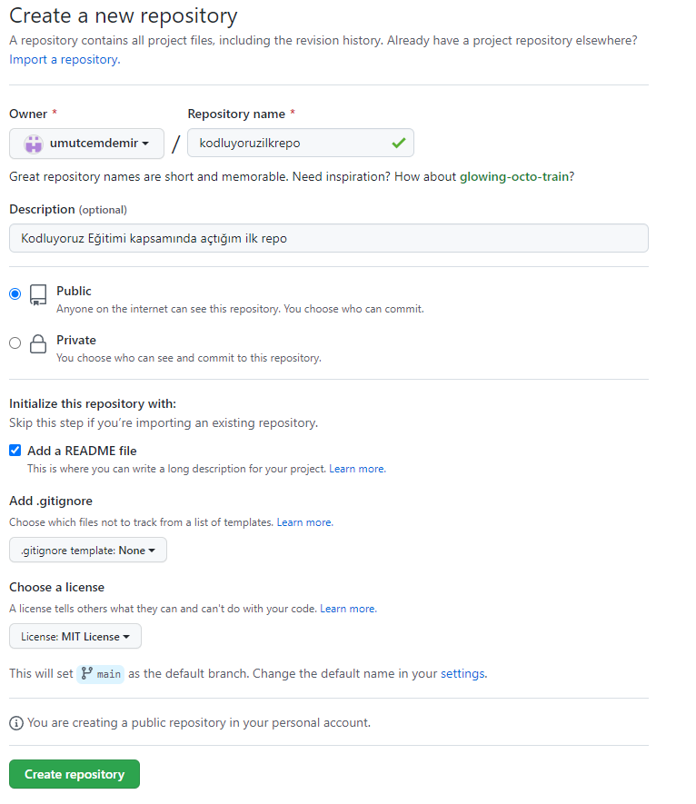

# Kodluyoruz Ilk Repo
Bu repo [Kodluyoruz](https://kodluyoruz.org/tr/kodluyoruz/) Front-End Eğitiminde oluşturduğumuz ilk repo. İçerisinde bir adet README dosyası, bir adet de index.html barındırıyor.

## Installation

Öncelikle projeyi clonelayın. (Buraya sizin reponuzdan aldığınız link gelecek)

<pre>
git clone https://github.com/umutcemdemir/kodluyoruzilkrepo.git
</pre>

## Usage

Projeyi cloneladıktan sonra Visual Studio 

Code programında açınız.

Linux için:

<pre>
cd kodluyoruzilkrepo
code .
</pre>

## Contributing
Pull requestler kabul edilir. Büyük değişiklikler için, lütfen önce neyi değiştirmek istediğinizi tartışmak için bir konu açınız.

## License
[MIT](https://choosealicense.com/licenses/mit/)